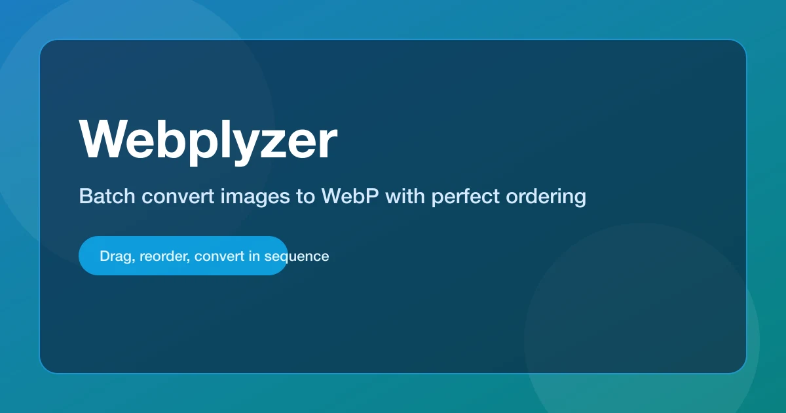

<div align="center">



# Converter WebP/WebM

**バッチ WebP / WebM 変換ツール**

[](https://nextjs.org/)
[](https://react.dev/)
[](https://www.typescriptlang.org/)
[](LICENSE)

**複数の画像・動画を簡単に WebP / WebM へ変換**

</div>

---

## 目次

- [概要](#-概要)
- [主な機能](#-主な機能)
- [対応フォーマット](#-対応フォーマット)
- [セットアップ](#-セットアップ)
- [使用方法](#-使用方法)
- [技術スタック](#-技術スタック)
- [プロジェクト構成](#-プロジェクト構成)
- [スクリプト](#-スクリプト)
- [ライセンス](#-ライセンス)

---

## 概要

Converter WebP/WebM は、Next.js 16 App Router で構築されたモダンなバッチ変換ツールです。複数の画像や動画をドラッグ&ドロップで簡単にアップロードし、WebP（画像）や WebM（動画）形式へ一括変換できます。

- **シンプルな操作**: ドラッグ&ドロップで直感的にファイルを追加
- **モダンなUI**: ダークモード対応の洗練されたインターフェース
- **高速変換**: サーバーサイドで効率的な変換処理
- **一括処理**: 最大25ファイルまで同時に変換可能
- **順序変更**: ドラッグ&ドロップで簡単に並び替え

---

## 主な機能

### 画像変換
- **WebP 変換**: `sharp` による高品質な WebP 変換（品質 90）
- **HEIC/HEIF 対応**: Apple デバイスで撮影された HEIC 形式も変換可能
- **アニメーション GIF 対応**: アニメーション GIF をアニメーション WebP に変換
- **EXIF 情報保持**: 画像の向き情報を自動補正

### 動画変換
- **WebM 変換**: `ffmpeg` による VP9 + Opus コーデックでの変換
- **高品質エンコード**: 最適化された設定でファイルサイズと品質のバランスを実現

### ユーザーインターフェース
- **ダークモード**: 目に優しいダークテーマを標準搭載
- **ドラッグ&ドロップ**: SortableJS による直感的な並び替え
- **Toast 通知**: sonner による非侵入的な通知システム
- **進捗表示**: リアルタイムで変換進捗を表示
- **コンポーネント化**: 保守性の高いモジュール設計

### 一括処理
- **最大25ファイル**: 一度に複数のファイルを処理
- **ZIP ダウンロード**: 複数ファイルは自動的に ZIP にまとめて配布
- **連番リネーム**: 指定したベース名に連番を付けて整理

---

## 対応フォーマット

### 画像形式
| フォーマット | 拡張子 | 備考 |
|------------|--------|------|
| JPEG | `.jpg`, `.jpeg` | 標準的な写真形式 |
| PNG | `.png` | 透明度対応 |
| AVIF | `.avif` | 次世代画像フォーマット |
| SVG | `.svg` | ベクター画像 |
| HEIC/HEIF | `.heic`, `.heif` | Apple デバイス標準 |
| TIFF | `.tif`, `.tiff` | 高品質画像 |
| BMP | `.bmp` | Windows 標準 |
| GIF | `.gif` | アニメーション対応 |

### 動画形式
| フォーマット | 拡張子 | 備考 |
|------------|--------|------|
| MP4 | `.mp4` | 最も一般的な動画形式 |
| MOV | `.mov` | QuickTime 形式 |
| MKV | `.mkv` | Matroska コンテナ |
| AVI | `.avi` | Windows 標準 |
| WebM | `.webm` | Web 標準 |
| M4V | `.m4v` | iTunes 形式 |

> **制限事項**: 各ファイルは最大 20MB まで、一度に最大 25 ファイルまで処理可能です。

---

## セットアップ

### 前提条件

- **Node.js**: 20.9+ 以上（Next.js 16 の要件）
- **npm**: 最新版を推奨

### インストール手順

```bash
# リポジトリをクローン
git clone https://github.com/ManatoYamashita/converter-webp-webm.git
cd converter-webp-webm

# 依存パッケージをインストール
npm install

# 開発サーバーを起動
npm run dev
```

ブラウザで [http://localhost:3000](http://localhost:3000) を開くとアプリケーションが表示されます。

> **ヒント**: Node.js のバージョン管理には `nvm` の使用を推奨します。プロジェクトルートで `nvm use` を実行してください。

---

## 使用方法

### 1. ファイルのアップロード

- **ドラッグ&ドロップ**: ファイルをアップロードエリアにドラッグ&ドロップ
- **ファイル選択**: 「ファイルを選択」ボタンをクリックしてファイルを選択
- **追加**: 最大25ファイルまで追加可能

### 2. ファイルの並び替え

- サムネイルカードをドラッグ&ドロップして順序を変更
- 不要なファイルは削除ボタン（×）で個別に削除可能

### 3. ベース名の設定

- デフォルトは `image` です
- カスタムベース名を入力すると、変換後のファイル名が `<base>_1.webp`, `<base>_2.webp` のように連番で生成されます

### 4. 変換の実行

- 「変換開始」ボタンをクリック
- 進捗バーで変換状況を確認
- 単一ファイルの場合は即座にダウンロード、複数ファイルの場合は ZIP ファイルとしてダウンロードされます

---

## 技術スタック

### コア技術
- **[Next.js](https://nextjs.org/)** `16.0.3` - React フレームワーク（App Router）
- **[React](https://react.dev/)** `19.2.0` - UI ライブラリ
- **[TypeScript](https://www.typescriptlang.org/)** `5.6` - 型安全性

### UI & スタイリング
- **[Tailwind CSS](https://tailwindcss.com/)** - ユーティリティファーストの CSS フレームワーク
- **[SortableJS](https://sortablejs.github.io/Sortable/)** - ドラッグ&ドロップ機能
- **[Sonner](https://sonner.emilkowal.ski/)** - Toast 通知システム
- **[Lucide React](https://lucide.dev/)** - アイコンライブラリ

### 変換エンジン
- **[Sharp](https://sharp.pixelplumbing.com/)** - 高性能画像処理ライブラリ
- **[heic-convert](https://www.npmjs.com/package/heic-convert)** - HEIC/HEIF 変換
- **[FFmpeg](https://ffmpeg.org/)** (`ffmpeg-static` + `fluent-ffmpeg`) - 動画変換

### その他
- **[JSZip](https://stuk.github.io/jszip/)** - ZIP ファイル生成
- **[Turbopack](https://turbo.build/pack)** - 高速バンドラー（Next.js 16 組み込み）

---

## プロジェクト構成

```
converter-webp-webm/
├── app/                      # Next.js App Router
│   ├── api/
│   │   └── convert/          # 変換 API エンドポイント
│   │       └── route.ts      # 画像/動画変換ロジック
│   ├── page.tsx              # メインページ（状態管理）
│   ├── layout.tsx             # ルートレイアウト
│   └── globals.css           # グローバルスタイル
├── components/                # UI コンポーネント
│   ├── AppHeader.tsx         # ヘッダーコンポーネント
│   ├── UploadDropzone.tsx    # アップロードエリア
│   ├── SelectedFiles.tsx     # ファイル一覧（並び替え可能）
│   ├── ProgressPanel.tsx     # 進捗表示パネル
│   ├── StickyConvertButton.tsx # 変換ボタン
│   ├── FloatingUploader.tsx  # フローティングアップロードボタン
│   └── types.ts              # 型定義
├── lib/                      # ユーティリティ
│   └── sanitizeFilename.ts   # ファイル名サニタイズ
├── public/                   # 静的アセット
│   └── ogp.webp              # OGP 画像
├── docs/                     # プロジェクトドキュメント
│   ├── specs/                # 仕様書
│   └── dev/                  # 開発ドキュメント
└── package.json              # 依存関係とスクリプト
```

---

## スクリプト

| コマンド | 説明 |
|---------|------|
| `npm run dev` | 開発サーバーを起動（Turbopack 使用） |
| `npm run build` | 本番用ビルドを生成 |
| `npm run start` | 本番サーバーを起動 |
| `npm run lint` | ESLint によるコードチェック |

### 開発時の推奨ワークフロー

```bash
# 1. 依存関係のインストール
npm install

# 2. 開発サーバー起動
npm run dev

# 3. コードチェック（別ターミナル）
npm run lint

# 4. 本番ビルドの確認
npm run build
npm run start
```

---

## ライセンス

このプロジェクトは [MIT License](LICENSE) の下で公開されています。

---

<div align="center">

**Made with Next.js 16 & React 19**

[Report Bug](https://github.com/ManatoYamashita/converter-webp-webm/issues) · [Request Feature](https://github.com/ManatoYamashita/converter-webp-webm/issues)

</div>
